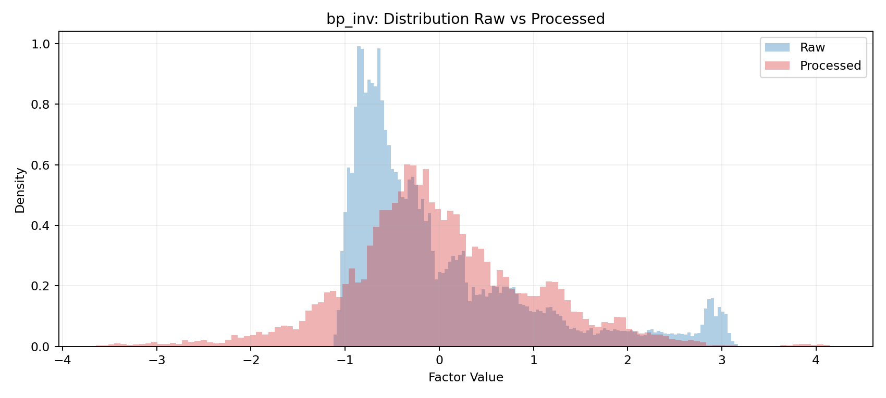

# Factor Mining Pipeline 因子构建流水线

## 基本信息

* 数据来源：Wind数据库。Wind的数据放在了本地的SQL Sever里面。
* 处理流程：
  * 0 规定整个的想要获取的交易日的信息。硬性规定交易日以及每个交易日研究的股票。
  * 1 获取因子并进行缺失值处理、MAD异常值处理、归一化处理。
  * 

## 0 交易日和股票对象获取

在0_universal_information_definition\config.py中进行你的数据库信息的设置以及你想要进行的日期范围设置以及股票池（指数）的设置。0_universal_information_definition\common负责这个调用0_universal_information_definition\stock_pool\query_daily_dynamic.sql和0_universal_information_definition\trading_days\query.sql两个查询语句进行数据的查询和最终格式的整理。

最终的输出是0_universal_information_definition\outputs\stock_pool_daily中的，每天一个交易日文件，每个文件当中对应着研究的股票池的股票代码。

## 1 因子获取与预处理

每个因子独立进行获取与处理。所经历的流程如下：

* 读取 0_universal_information_definition/outputs 的目标交易日和目标股票池
* 根据该因子 LOOKBACK_TRADING_DAYS 计算查询起点
* 执行该因子 SQL
* 对齐到目标键（trade_date, stock_code）
* 做该因子缺失处理 → MAD → 标准化
* 写该因子输出与 summary

注意，LOOKBACK_TRADING_DAYS写在对应的config里面，然后再使用sql查询。目的是预防出现前几个的因子值是空值。是先用sql查询，然后构建表格，使得sql查询的结果填充到对应的坑里。接下来才是一般的缺失值处理、mad异常值处理以及标准化。

| 因子的代码 | 因子的含义 | 因子的计算方式 |
|---|---|---|
| `halpha_12m` | 12个月历史 alpha（相对市场） | 先把个股和市场的日收益聚合为月收益；对每只股票做滚动12个月线性回归 `ret_m ~ mkt_ret_m`，取截距 alpha 作为因子值 |
| `return_1m` | 1个月收益率 | `close_price.pct_change(20)` |
| `return_3m` | 3个月收益率 | `close_price.pct_change(60)` |
| `return_6m` | 6个月收益率 | `close_price.pct_change(120)` |
| `return_12m` | 12个月收益率 | `close_price.pct_change(240)` |
| `wgt_return_1m` | 1个月换手加权收益 | 先算日收益 `ret_1d`，再算窗口内 `sum(turn_d * ret_1d) / sum(turn_d)`，窗口20日 |
| `wgt_return_3m` | 3个月换手加权收益 | 同上，窗口60日 |
| `wgt_return_6m` | 6个月换手加权收益 | 同上，窗口120日 |
| `wgt_return_12m` | 12个月换手加权收益 | 同上，窗口240日 |
| `exp_wgt_return_1m` | 1个月指数衰减换手加权收益 | 在20日窗口中用指数衰减权重（`halflife=20`）对 `turn_d * ret_1d` 加权，再除以加权 `turn_d` |
| `exp_wgt_return_3m` | 3个月指数衰减换手加权收益 | 同上，窗口60日 |
| `exp_wgt_return_6m` | 6个月指数衰减换手加权收益 | 同上，窗口120日 |
| `exp_wgt_return_12m` | 12个月指数衰减换手加权收益 | 同上，窗口240日 |
| `momentum_5` | 5日动量 | `close_price.pct_change(5)` |
| `momentum_20` | 20日动量 | `close_price.pct_change(20)` |
| `momentum_60` | 60日动量 | `close_price.pct_change(60)` |
| `reversal_5` | 5日反转 | `-close_price.pct_change(5)` |
| `volatility_20` | 20日波动率 | 先算 `ret_1d`，再取 `ret_1d.rolling(20).std()` |
| `downside_vol_20` | 20日下行波动率 | 先算 `ret_1d`，取负收益部分 `ret_neg = ret_1d if ret_1d<0 else 0`，再 `ret_neg.rolling(20).std()` |
| `drawdown_20` | 20日回撤 | `close_price / rolling_max(close_price,20) - 1` |
| `turnover_proxy_20` | 20日换手代理 | 先算日换手代理 `amount / total_market_cap`，再做20日均值 |
| `illiq_20` | 20日非流动性（Amihud风格） | 先算 `illiq_1d = abs(ret_1d) / (abs(amount)+1)`，再做20日均值 |
| `roe` | 净资产收益率 | 直接取对齐后的 `roe` |
| `size_log_mcap` | 规模因子 | `log(total_market_cap)`（先裁到最小1） |
| `ep_ttm` | 盈利收益率 | `1 / pe_ttm`（极小值做保护） |
| `bp_inv` | 账面市值比 | `1 / pb_lf`（极小值做保护） |
| `revenue_yoy` | 营收同比增速 | 直接取对齐后的 `revenue_yoy` |
| `netprofit_yoy` | 净利润同比增速 | 直接取对齐后的 `netprofit_yoy` |

注意所有涉及到财报中展示的数据均涉及为下一日生效。

## 2 因子正交化

为了排除市值和行业的影响，得到纯alpha，要对原因子进行正交化。核心是对现有因子进行加权回归，自变量是市值和行业，得到的残差就是应该取得的纯的因子。

公式（单日 \(t\)）：

\[
f_{i,t} = \alpha_t + \beta_t \ln(MV_{i,t}) + \sum_{k=1}^{K-1}\gamma_{k,t} D_{i,k,t} + \varepsilon_{i,t}
\]

- \(f_{i,t}\)：原始因子值  
- \(\ln(MV_{i,t})\)：市值暴露  
- \(D_{i,k,t}\)：行业哑变量（去掉一个基准行业）  
- \(\varepsilon_{i,t}\)：中性化后“纯因子”

做 WLS：

\[
\min_{\theta_t}\sum_i w_{i,t}\left(f_{i,t}-X_{i,t}\theta_t\right)^2
\]

常见权重：\(w_{i,t}=\sqrt{MV_{i,t}}\)（比直接用 \(MV\) 更稳）。

要注意的特殊因子：

* `size_log_mcap`  
不要再对市值中性化，否则会被回归掉（几乎变成噪声）。

整体的处理流程是：

* 参考0_universal_information_definition构建的交易日的股票池，去获取市值和行业
  * 如果出现股票出现市值和行业对不上出现空值的情况，对于市值，则当天这条缺失的股票不计入正交化留空；对于行业，则新增一个unknow类别保证流程正常进行。最后得到残差之后还要进行缺失值处理、异常值处理以及归一化。
* 独立对每个因子进行WSL回归，得到每个因子的残差，然后进行缺失值处理、异常值处理以及归一化。
* 最后合并为每天一个csv，存储所有的因子。

对比一下处理前后的数据，对所有交易日的所有的股票的所有因子进行聚合：

前后聚合因子的数值分布：

